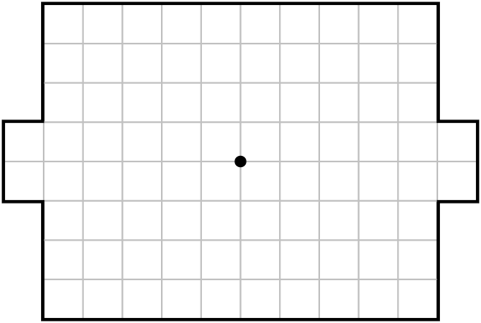
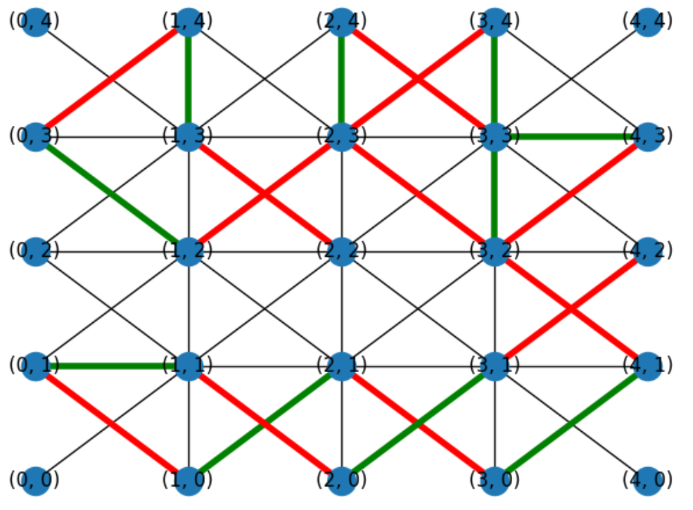

# Paper Soccer Solver

Paper Soccer, also known as Paper Hockey, is an abstract strategy game played on a square grid representing a soccer or hockey field. It is played by two players who take turns extending the line representing the ball's position until it reaches one of the two goal areas on the grid. This game is traditionally played on paper using a pencil and is popular in schools and sometimes found in certain publications. There are also many computer implementations of this game. Despite its simple rules, Paper Soccer offers diverse strategies and tactics.

## Game Rules

1. Game Grid: The game is played on a square or rectangular grid that represents a soccer or hockey field. The grid consists of cells connected by lines.

2. Game Start: At the beginning of the game, the ball is placed in the center of the grid.

3. Moves: Players take turns making moves. In their turn, a player extends the line starting from the last point where the ball is and leads it to an adjacent cell on the grid. The ball cannot move along the edges of the field or the lines it has already traversed but can bounce off them. If the final position of the line is at the end of an existing line segment or the edge of the field, the player gets to make another move.

4. Goals: The objective of the game is to get the ball into one of the two goal areas located on opposite sides of the grid.

5. Limitation Rules: The ball cannot leave the field or pass through lines that have already been drawn. A player cannot end their move on a cell where there is already a line or the ball.

6. Game End: The game ends when the ball reaches one of the goals. The player who successfully scores a goal earns a point. Alternatively, players can play to reach a predetermined number of points or for a specified time limit.

This is a CPLEX program that solves a specific optimization problem. The program is written in the CPLEX Optimizer language.

Here is an example of a game played by the solver:

- The red color represents player one.
- The green color represents player zero.
- The initial turn belongs to player one.

## Installation

To run the CPLEX program, you need to have CPLEX installed on your machine. Follow the steps below to get started:

1. Download and install CPLEX from the IBM website [here](https://www.ibm.com/products/ilog-cplex-optimization-studio).

2. Clone the repository or download the program files.

3. Open the terminal or command prompt and navigate to the program's directory.

4. Compile the program using the appropriate compiler command. For example:

## License

This project is licensed under the [MIT License](license.txt).
